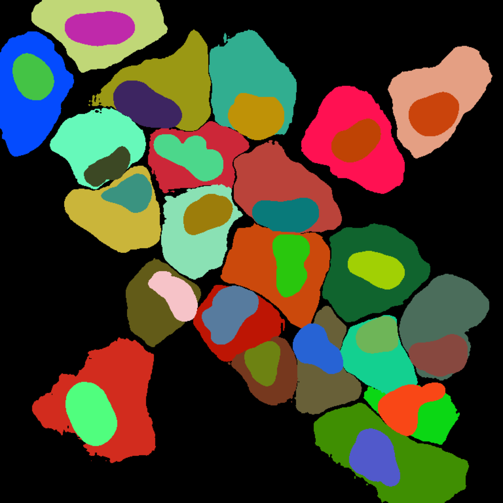
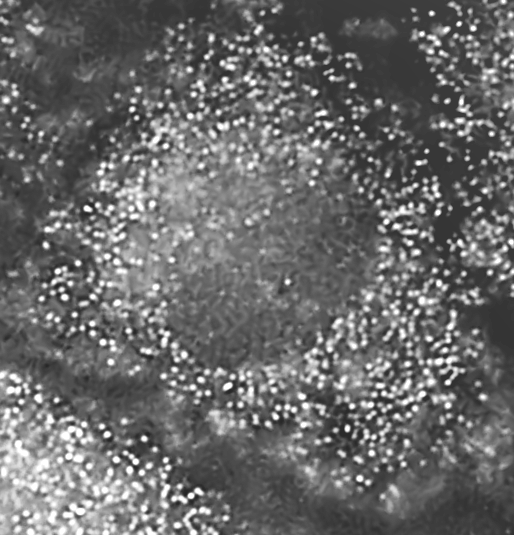
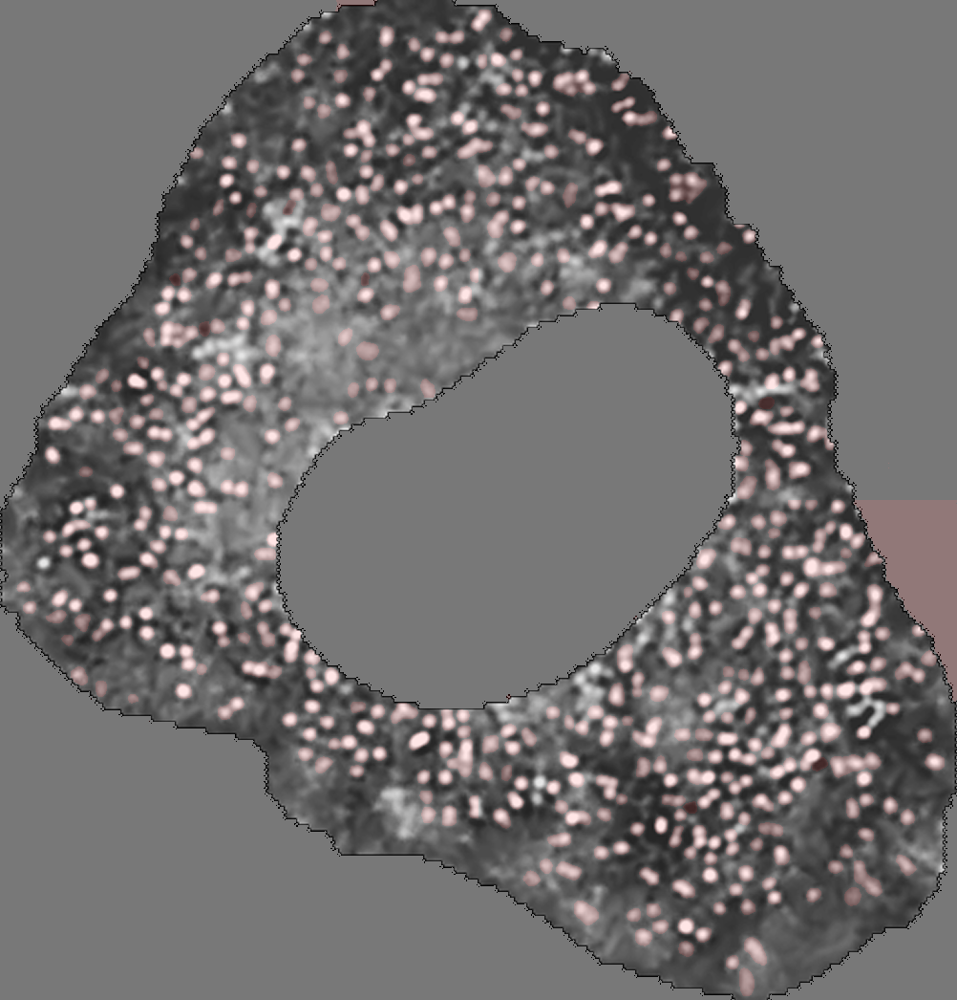
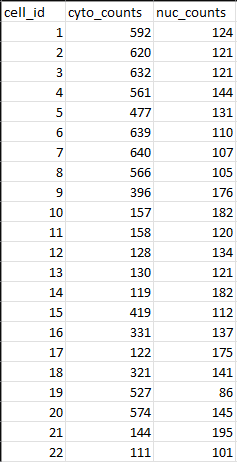

# FishNet
FishNet utilizes the Segment Anything model from Meta to automate common image processing tasks. This tool is specifically designed for Biology but the overall methods can be abstracted to other fields.

The goal of this project is to provide a tool that helps automate visualization of smFISH microscopy images. This includes outlining cytoplasm, outlining nuclei, labeling cells, and counting the "dots" present within each depending on color channel.

### Workflow Video

https://www.youtube.com/watch?v=e0mEtA5YYvQ

The above is a video demonstrating how the tool works for a segmentation tasks. Users work with the segment anything model to output segmentations that they feel is useful for their use case.

### The following is example output from the SAM assisted segmentation step.

##### Outlines and Cell IDs

##### Segmentation Overlay

##### Pure Segmentation

### The following is example output from the pure SAM "dot" counting step.

##### Cell 2 Crop

##### Cytoplasm "Dot" Segmentations

##### Output CSV

Thank you to Meta for releasing their model for public use. The following is a link to their repo, https://github.com/facebookresearch/segment-anything.
